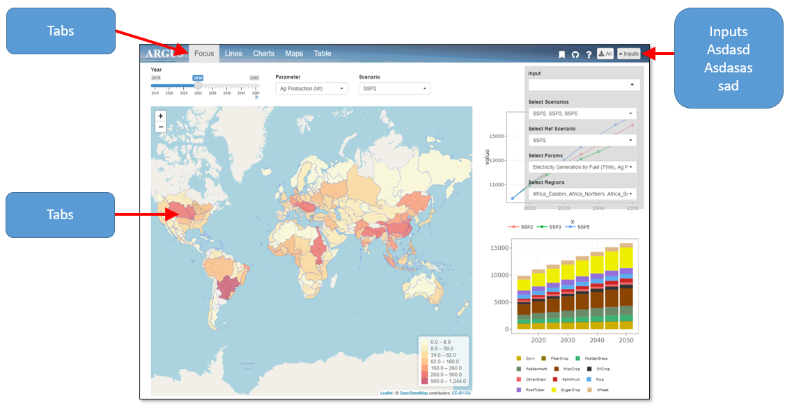

<!-- ------------------------>
<!-- ------------------------>
# Overview
<!-- ------------------------>
<!-- ------------------------>

## Layout:

 *General Layout* 

 

## Inputs:
Brief discussion

## Boomarking:
Brief discussion

<!-- ------------------------>
<!-- ------------------------>
# Focus
<!-- ------------------------>
<!-- ------------------------>

- Details on focus tab

<!-- ------------------------>
<!-- ------------------------>
# Lines
<!-- ------------------------>
<!-- ------------------------>

- Details on Lines tab

<!-- ------------------------>
<!-- ------------------------>
# Charts
<!-- ------------------------>
<!-- ------------------------>

- Details on charts tab

<!-- ------------------------>
<!-- ------------------------>
# Maps
<!-- ------------------------>
<!-- ------------------------>

- Details on maps tab

<!-- ------------------------>
<!-- ------------------------>
# Table
<!-- ------------------------>
<!-- ------------------------>

- Details on Table tab
