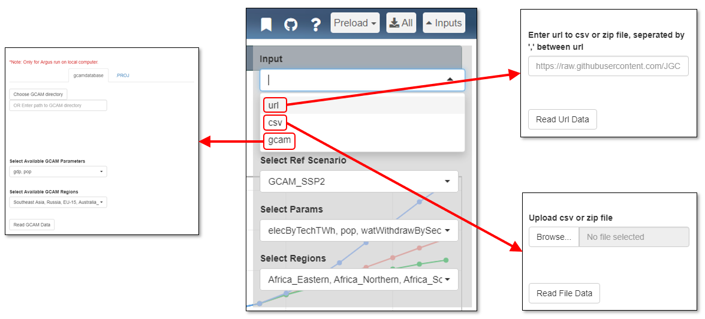
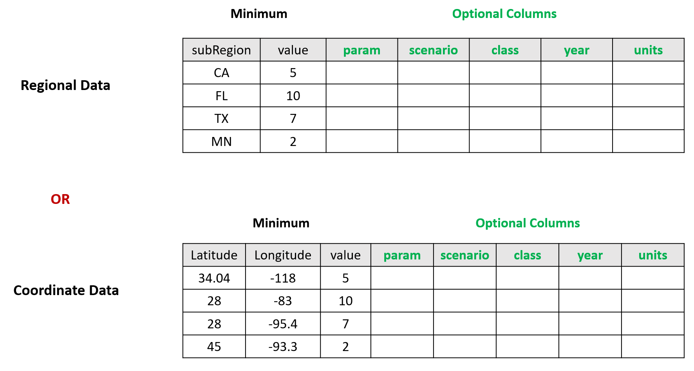
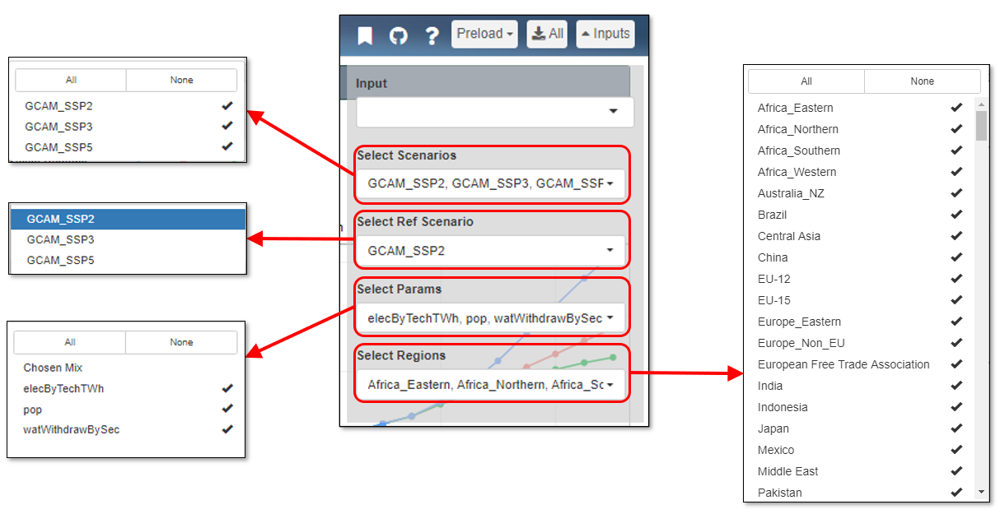

<!-- ------------------------>
<!-- ------------------------>
# Overall Layout
<!-- ------------------------>
<!-- ------------------------>

 

 *General Layout* 

 

<!-- ------------------------>
<!-- ------------------------>
# Inputs
<!-- ------------------------>
<!-- ------------------------>

 

Within the input panel, there is a data input drop down and several selection drop downs.

<!-- ------------------------>
<!-- ------------------------>
## Data Input
<!-- ------------------------>
<!-- ------------------------>

Data inputs can be uploaded through a url, csv file, or GCAM directory. Select one and the corresponding input window will appear.

 

Uploaded data must be formatted like the following:

 

<!-- ------------------------>
<!-- ------------------------>
## Selections
<!-- ------------------------>
<!-- ------------------------>

Other drop downs include selections for:

- Scenarios Running
- Reference Scenario
- Parameters Displayed
- Regions Included

These selections can be changed at anytime by clicking the inputs drop down in the upper right corner. Checkmarks next to items signify selection.

 

<!-- ------------------------>
<!-- ------------------------>
# Top Bar
<!-- ------------------------>
<!-- ------------------------>

 

On the right side of the top bar, there are four additional icons along with the inputs panel:

1. Bookmarking
1. Github
1. Help
1. Download All

 

<!-- ------------------------>
<!-- ------------------------>
## 1. Bookmarking {#top_bookmarking}
<!-- ------------------------>
<!-- ------------------------>

By clicking the bookmarking icon, you can obtain a downloadable .RDS file or a URL linking to the webpage as it currently appears, saving all inputs and modifications. With this icon, you can also load a previously created bookmark. Step-by-step instruction on creating, sharing and loading bookmarks is provided in the [Bookmarks](#bookmarks) section.

 

<!-- ------------------------>
<!-- ------------------------>
## 2. Github
<!-- ------------------------>
<!-- ------------------------>

The Github icon will redirect you to the Argus Github page. On this page you can find the Argus source code.

 

<!-- ------------------------>
<!-- ------------------------>
## 3. Help
<!-- ------------------------>
<!-- ------------------------>

Clicking the help icon will take you to the webpage including the Installation and User Guide.

 

<!-- ------------------------>
<!-- ------------------------>
## 4. Download All
<!-- ------------------------>
<!-- ------------------------>

The download all button allows the user to download all figures from all tabs that are created for the inputted data into a single file.

<!-- ------------------------>
<!-- ------------------------>
# Bookmarks {#bookmarks}
<!-- ------------------------>
<!-- ------------------------>

## Create a Bookmark

- Choose all your inputs (scenarios, parameters, years, zoom levels etc.)
- Click the bookmark icon in the top bar as shown in the figure below.
- Click `Download Boomark` and choose an appropriate name (e.g. `my_argus_bookmark.rds`).
- Argus will download your current state and save as `my_argus_bookmark.rds`.

## Share a Bookmark

- You can now share the `my_argus_bookmark.rds` file directly with anyone.
- You can also upload the file to a github repository or zenodo account and then share the direct link to that file.

## Load a Bookmark

- Click the bookmark icon shown in the figure below
- Click `Upload Boomark` and choose the appropriate bookmark file (e.g. `my_argus_bookmark.rds`)
- OR enter the appropriate link to your bookmark saved online in the `Read Bookmark from URL` box.

 

<!-- ------------------------>
<!-- ------------------------>
# Focus
<!-- ------------------------>
<!-- ------------------------>

 

The Focus tab gives an overview of the data input based on the year, parameter, and scenario selected. These can be changed using the scrollbar and dropdown menus pointed out at the top of the page. The overview map and comparative charts with change to reflect the selections.

 

<!-- ------------------------>
<!-- ------------------------>
# Lines
<!-- ------------------------>
<!-- ------------------------>

 

The Lines tab shows graphs plotted over time to compare each scenario by parameter. These figures can be downloaded by using the download page button in the upper right corner.

The user can also visualize each scenario by parameter split into several regions with the Compare Regions tab. In this tab, each row of graphs show one parameter over several regions.

 

<!-- ------------------------>
<!-- ------------------------>
# Charts
<!-- ------------------------>
<!-- ------------------------>

 

The Charts tab shows stacked bar graphs for each parameter by scenario, with descriptive legends below each set of graphs. Each parameter is labeled on the far left of the graphs, and each scenario is labeled on the top. These figures can be downloaded by using the download page button in the upper right corner.

The landing page for this tab is the Absolute Value charts. The user can also navigate to the Absolute Difference or Percent Difference charts. The Absolute and Percent Difference charts display the reference scenario charts on the left and the differences between the reference scenario and the other scenarios on the right.

 

<!-- ------------------------>
<!-- ------------------------>
# Maps
<!-- ------------------------>
<!-- ------------------------>

 

The Maps tab shows each parameter by scenario split up by region. The maps can show these data over different years by using the scrollbar in the upper left. Each parameter is labeled on the far left of the maps, and each scenario is labeled on the top. The legend type can be changed using the drop down menu at the top of the page, and this will change the legends seen underneath each set of maps. These figures can be downloaded by using the download page button in the upper right corner.

The landing page for this tab is the Absolute Value maps. The user can also navigate to Absolute Difference or Percent Different maps. The Absolute Difference and Percent Difference maps show the difference in each parameter between the reference scenario set in the inputs menu and the other scenarios selected. 

 

<!-- ------------------------>
<!-- ------------------------>
# Table
<!-- ------------------------>
<!-- ------------------------>

 

The Table tab displays a table with every data point entered. This table can be downloaded using the download page button in the upper right corner. The table can be searched for specific values, years, etc. using the search bar, and the column filters can be used to display specified sets of data. The user can also navigate between pages using the icons in the bottom right corner.

 

