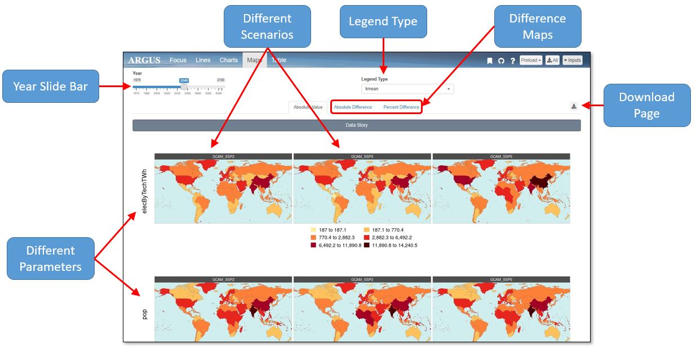

<!-- ------------------------>
<!-- ------------------------>
# Overview
<!-- ------------------------>
<!-- ------------------------>

## Layout:

 *General Layout* 

 

<!-- ------------------------>
<!-- ------------------------>
## Inputs:
<!-- ------------------------>
<!-- ------------------------>

Within the input panel, there is a data input drop down and several selection drop downs.

<!-- ------------------------>
<!-- ------------------------>
### Data Input
<!-- ------------------------>
<!-- ------------------------>
Data inputs can be uploaded through a url, csv file, or GCAM directory. Select one and the corresponding input window will appear.

 

<!-- ------------------------>
<!-- ------------------------>
### Selections
<!-- ------------------------>
<!-- ------------------------>

Other drop downs include selections for:
  : - Scenarios Running
  : - Reference Scenario
  : - Parameters Displayed
  : - Regions Included
These selections can be changed at anytime by clicking the inputs drop down in the upper right corner.

<!-- ------------------------>
<!-- ------------------------>
# Top Bar
<!-- ------------------------>
<!-- ------------------------>

1. On the right side of the top bar, there are four additional icons along with the inputs panel.
1. Bookmarking
1. Github
1. Help
1. Download All

 

<!-- ------------------------>
<!-- ------------------------>
## 1. Bookmarking
<!-- ------------------------>
<!-- ------------------------>
By clicking the bookmarking icon, you can obtain a downloadable .RDS file or a URL linking to the webpage as it currently appears, saving all inputs and modifications. With this icon, you can also load a previously created bookmark.

 

<!-- ------------------------>
<!-- ------------------------>
## 2. Github
<!-- ------------------------>
<!-- ------------------------>

The Github icon will redirect you to the Argus Github page. On this page you can find the Argus source code.

 

<!-- ------------------------>
<!-- ------------------------>
## 3. Help
<!-- ------------------------>
<!-- ------------------------>

Clicking the help icon will take you to the webpage including the Installation and User Guide.

 

<!-- ------------------------>
<!-- ------------------------>
## 4. Download All
<!-- ------------------------>
<!-- ------------------------>

Add brief description

<!-- ------------------------>
<!-- ------------------------>
# Focus
<!-- ------------------------>
<!-- ------------------------>

- Details on focus tab

 

<!-- ------------------------>
<!-- ------------------------>
# Lines
<!-- ------------------------>
<!-- ------------------------>

- Details on Lines tab

 

<!-- ------------------------>
<!-- ------------------------>
# Charts
<!-- ------------------------>
<!-- ------------------------>

- Details on charts tab

<!-- ------------------------>
<!-- ------------------------>
# Maps
<!-- ------------------------>
<!-- ------------------------>

- Details on maps tab

 

<!-- ------------------------>
<!-- ------------------------>
# Table
<!-- ------------------------>
<!-- ------------------------>

- Details on Table tab
